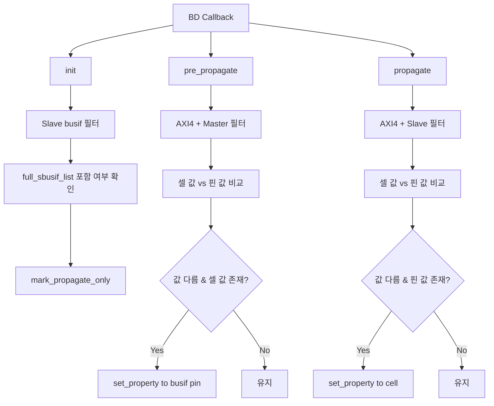

# `bd.tcl` Analysis

## 역할 요약
Block Design(BD) 문맥에서 AXI 인터페이스 파라미터를 **셀 파라미터와 인터페이스 핀 사이에 동기화**하는 스크립트입니다.

- `init`: 특정 파라미터를 propagate-only로 마킹
- `pre_propagate`: Master 인터페이스 기준으로 셀→인터페이스 방향 반영
- `propagate`: Slave 인터페이스 기준으로 인터페이스→셀 방향 반영

동기화 대상 AXI 파라미터 목록:
- `ID_WIDTH`, `AWUSER_WIDTH`, `ARUSER_WIDTH`, `WUSER_WIDTH`, `RUSER_WIDTH`, `BUSER_WIDTH`

## 프로시저별 분석
### 1) `init`
- 모든 인터페이스 핀을 순회하면서 slave 인터페이스를 필터링합니다.
- `full_sbusif_list`에 포함된 인터페이스만 대상으로 삼도록 되어 있으나, 현재 리스트가 비어 있어 기본적으로 마킹이 수행되지 않습니다.
- 대상이 있을 경우 `C_<busif>_<PARAM>` 형식 파라미터를 `bd::mark_propagate_only`로 지정합니다.

### 2) `pre_propagate`
- `AXI4` 프로토콜 + `master` 모드 인터페이스만 처리합니다.
- 각 표준 파라미터에 대해 셀 설정값(`CONFIG.C_<busif>_<PARAM>`)과 인터페이스 핀 값(`CONFIG.<PARAM>`)을 비교합니다.
- 값이 다르고 셀 값이 비어 있지 않으면, 셀 값을 인터페이스 핀으로 씁니다.

### 3) `propagate`
- `AXI4` 프로토콜 + `slave` 모드 인터페이스만 처리합니다.
- 셀 값과 인터페이스 핀 값을 비교한 뒤, 값이 다르고 인터페이스 핀 값이 비어 있지 않으면 인터페이스 핀 값을 셀 파라미터로 씁니다.
- 주석대로 slave 쪽 값으로 셀 파라미터를 override하는 동작입니다.

## Block Diagram

## 요약
이 스크립트는 AXI 인터페이스 파라미터 전파 방향을 Master/Slave 별로 분리해 충돌을 줄이려는 목적을 가집니다. 다만 `init`의 `full_sbusif_list`가 빈 리스트이므로, 해당 훅의 실효성은 현재 제한적입니다.
