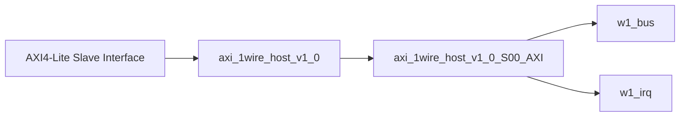

# axi_1wire_host_v1_0.v 분석

## 모듈 개요
AXI4-Lite 래퍼 Top 모듈이며, 내부적으로 `axi_1wire_host_v1_0_S00_AXI`를 인스턴스하여 전체 기능을 위임합니다.

- 주요 파라미터: `CLK_DIV_VAL_TO_1MHz`, `C_S00_AXI_DATA_WIDTH`, `C_S00_AXI_ADDR_WIDTH`
- 외부 포트: AXI4-Lite 슬레이브 포트 + `w1_bus` + `w1_irq`

## 구조
- 실질 로직은 하위 모듈(`..._S00_AXI`)에 집중되어 있고,
- 본 모듈은 포트 매핑/파라미터 전달 역할을 수행합니다.

## Block Diagram

