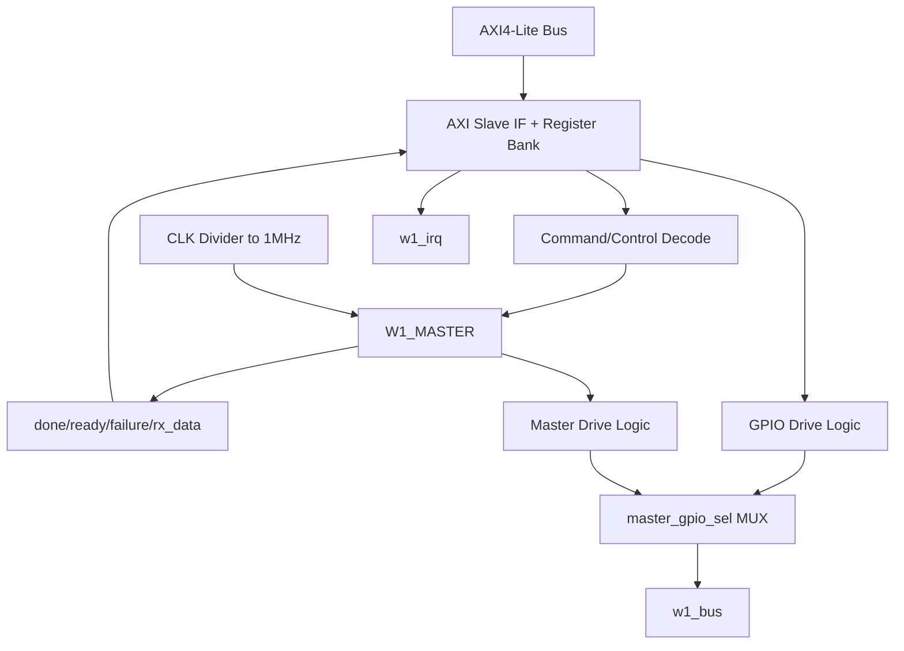

# axi_1wire_host_v1_0_S00_AXI.v 분석

## 모듈 개요
AXI4-Lite 슬레이브 레지스터 뱅크와 1-Wire 마스터 제어 로직의 브리지 역할을 수행합니다.

## 핵심 구성
- AXI4-Lite write/read 채널 핸드셰이크 로직.
- `slv_reg0~7` 레지스터 맵.
- 1-Wire 제어 신호 생성:
  - `command`, `tx_data`, `go`, `ctrl_reset`
- 1-Wire 상태 수집:
  - `done`, `ready`, `failure`, `rx_data`
- IRQ 출력 `w1_irq` 생성(ready/done IRQ enable 비트 기반).
- `master_gpio_sel`로 마스터 제어 vs GPIO 직결 제어 선택.

## 레지스터 맵(코드 기반 요약)
- `slv_reg0`: command/tx_data 등 명령 페이로드
- `slv_reg1`: go/reset/IRQ enable 등 제어 비트
- `slv_reg2`: done/failure 등 상태
- `slv_reg3`: rx_data
- `slv_reg6`: 버전 (`32'h76000101`)
- `slv_reg7`: ID (`32'h10ee4453`)

## Block Diagram

