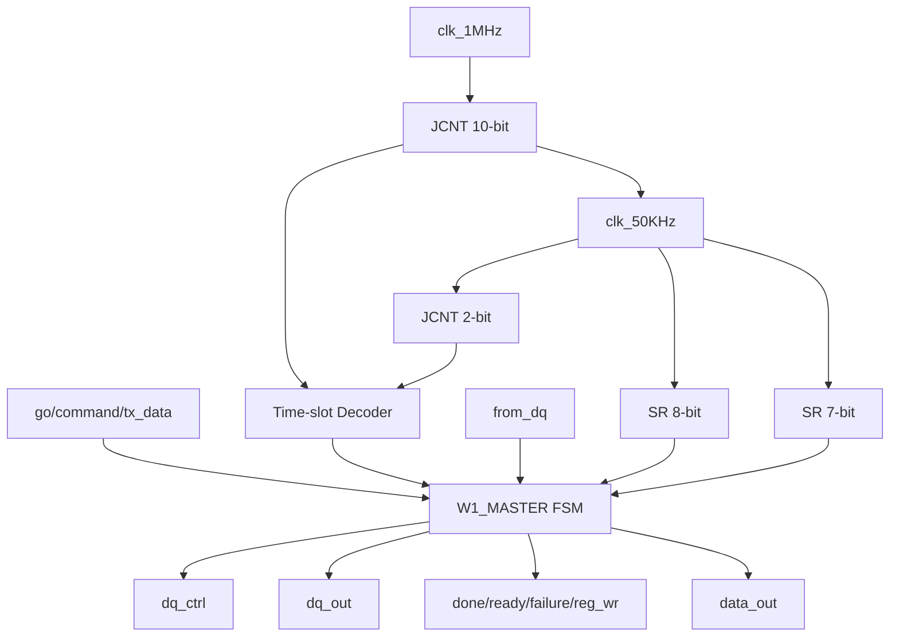

# w1_master.v 분석

## 모듈 개요
`W1_MASTER`는 1-Wire 프로토콜의 마스터 동작(초기화/비트 송수신/바이트 송수신)을 수행하는 FSM 기반 제어 모듈입니다.

- 입력: `clk_1MHz`, `areset`, `ctrl_reset`, `go`, `command[3:0]`, `tx_data[7:0]`, `from_dq`
- 출력: `dq_ctrl`, `dq_out`, `done`, `ready`, `reg_wr`, `failure`, `data_out[7:0]`

## 핵심 동작
- `reset = !areset | ctrl_reset` 으로 active-high 리셋 생성.
- 명령 기반 상태 전이: `INIT_M`, `TX_BIT_M`, `TX_BYTE_M`, `RX_BIT_M`, `RX_BYTE_M`.
- 내부 보조 상태: `IDLE_M`, `DONE_M`, `TX_RST_PLS`, `RX_PRE_PLS`.
- 타이밍 생성:
  - `JCNT(10bit)` + `JCNT(2bit)` 조합으로 1us/20us/80us 타임슬롯 식별.
  - `clk_50KHz = !jc1_q[9]`.
- 데이터 처리:
  - RX 비트/바이트를 `data_RX`에 누적 후 `data_out`으로 반영.
- 1-Wire 선로 제어:
  - `dq_ctrl`(방향), `dq_out`(출력값)을 레지스터드로 생성.

## FSM 요약
- **IDLE_M**: 대기 상태, `go`/`command` 입력 대기.
- **INIT_M/TX_RST_PLS/RX_PRE_PLS**: 리셋 펄스 송신 및 presence pulse 확인.
- **TX_BIT_M / TX_BYTE_M**: LSB 우선 송신.
- **RX_BIT_M / RX_BYTE_M**: 샘플링 타이밍에 맞춰 수신.
- **DONE_M**: 완료 플래그 제공 후 `go` clear handshake 대기.

## Block Diagram

