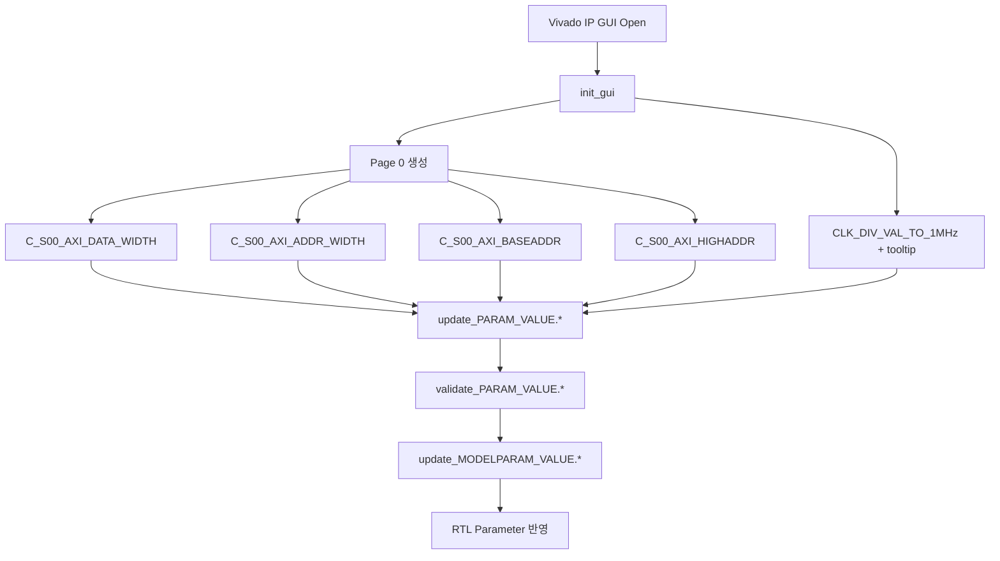

# `axi_1wire_host_v1_1.tcl` Analysis

## 역할 요약
이 스크립트는 Vivado IP Packager의 XGUI 레이어에서 **사용자 파라미터 UI를 정의**하고, UI에서 선택한 값들을 RTL 모델 파라미터로 전달하는 역할을 합니다.

- `init_gui`: 파라미터 위젯 생성 및 페이지 배치
- `update_PARAM_VALUE.*`: 파라미터 변경 시 후처리 훅(현재 비어 있음)
- `validate_PARAM_VALUE.*`: 입력 검증 훅(현재 모두 `true`)
- `update_MODELPARAM_VALUE.*`: GUI 파라미터 값을 HDL 파라미터에 반영

## 주요 파라미터
- `C_S00_AXI_DATA_WIDTH`: AXI 데이터 폭
- `C_S00_AXI_ADDR_WIDTH`: AXI 주소 폭
- `C_S00_AXI_BASEADDR`, `C_S00_AXI_HIGHADDR`: 주소 맵 범위
- `CLK_DIV_VAL_TO_1MHz`: AXI 클럭에서 1MHz 생성용 분주값

`CLK_DIV_VAL_TO_1MHz`는 tooltip으로 사용 예시(100MHz 입력이면 100)를 제공해 설정 의도를 명확히 합니다.

## 동작 흐름
1. IP GUI 초기화 시 `init_gui`가 호출됩니다.
2. 사용자가 파라미터를 수정하면 `update_PARAM_VALUE.*` 및 `validate_PARAM_VALUE.*`가 호출됩니다.
3. 최종 생성/갱신 시 `update_MODELPARAM_VALUE.*`가 GUI 값을 모델 파라미터로 복사합니다.

## Block Diagram

## 주석
현재 `update_PARAM_VALUE.*`는 구현이 비어 있고, 검증 함수도 항상 `true`를 반환하므로 실질적인 제약은 툴 기본 동작에 의존합니다.
